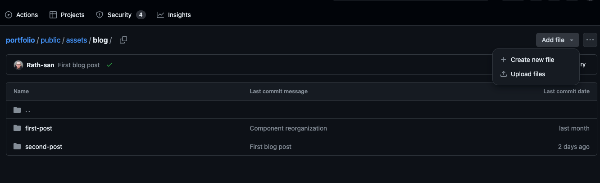
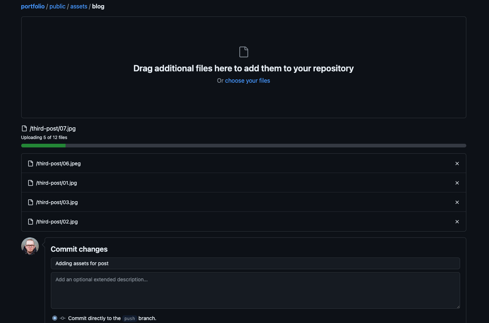
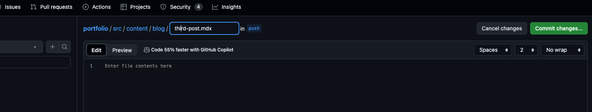
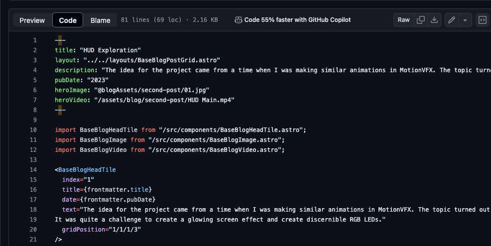
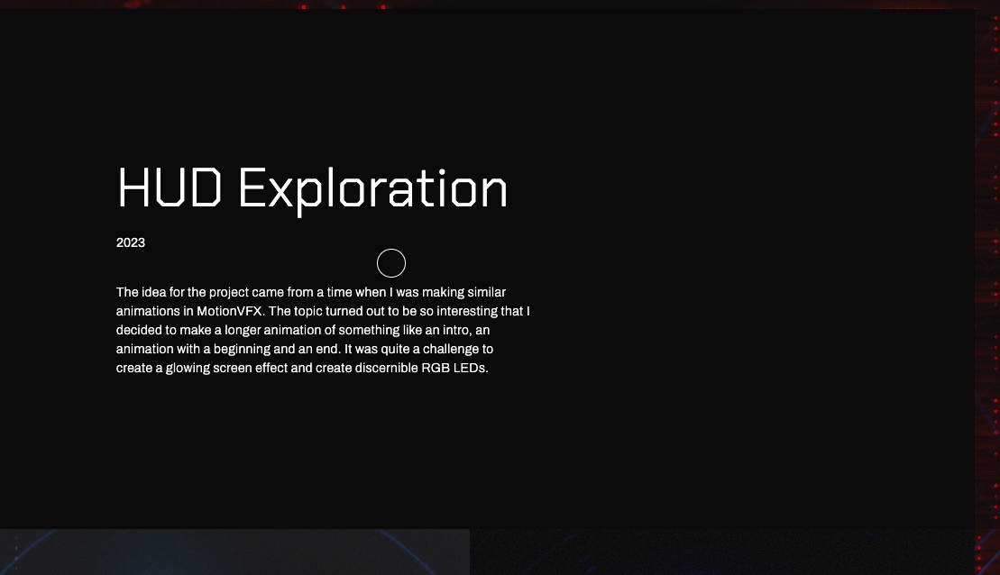
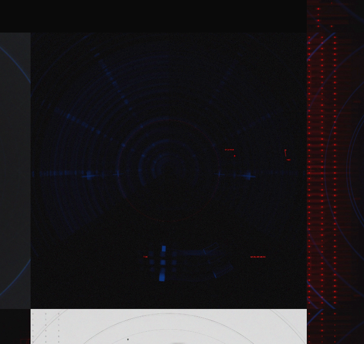
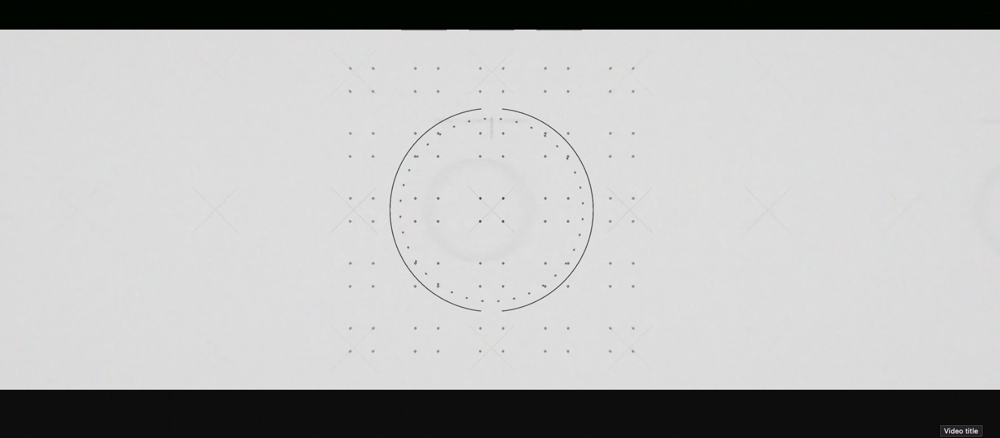

# How to add new projects

To add new projects you need 2 things:

1. File containing structure of given page
2. Set of files you want to see on project page

## To add assets
Just go to [assets](https://github.com/mmikolaj90/portfolio/tree/push/public/assets/blog) and add files via interface, all files should be flat in folder as in `second-post` example

WHen adding new subdirectory just move whole folder to drag area

When upload finished just hit commit changes and you should be golden with new stuff with assets

## To add project page structure
There will be more configuration here firstly the overall premise:

1. There is one template for new project page
2. Files are linked via structure in it
3. You can extend it with additional data if you want

New project pages reside in [content](https://github.com/mmikolaj90/portfolio/tree/push/src/content/blog) directory, there you ca nad new pages, those are written in `.mdx` format for now.
To add new file you just press `Add file` and copy content of prepared file there ex `third-post.mdx`

When finished with changes just `Commit changes...`

# Project page structure

## We have 2 section in project page template:

### Meta information (_`frontmatter`_)
Here you can add meta information 

| Property | Description |
| --------- | -------- |
| `title`   | You project page title |
| `layout` | Set in stone layout (one supported) _do not change this_ |
| `description` | Meta description in search results can be optimized for better `SEO` |
| `pubDate` | Publish date of post |
| `heroImage` | Main image for project first image on project page, also the image shown on home page |
| `heroVideo` | Main video for project (optional) |

And `import statements` those are blocks you want to use.
> To preserve consistency just copy and paste this section between `project` pages

### Content blocks structure
You can add `"blocks"` in this new file, those will render proper elements on your page.

| Block | Description |
| --------- | -------- |
| `BaseBlogHeadTile` | This is first text element on project page with description pub date and title provided from first section you can change those |
| `BaseBlogImage` | Image |
| `BaseBlogVideo` | Video |

Blocks have shared properties like `index`, `gridPosition`, those are controlling the display of those blocks in project page structure
| Property | Description |
| --------- | -------- |
|`index`| Is used for animation between pages, in this scenario its the row number|
|`gridPosition`| Is used to position items in grid `1/1/1/1` positions mean: `row-start`/`column-start`/`row-end`/`column-end` you have pretty granular control over positioning of blocks for example you can make block span 2 columns and 3 rows starting from second row and second column like this `2/2/3/4`|

## `BaseBlogHeadTile`
This allows you to add visible description to page

## `BaseBlogImage`
This is base image content in `src` property provide url from assets you've uploaded `src={"/assets/blog/third-post/img-2.jpg"}`

## `BaseBlogVideo`
This is base video content in `src` property provide url from assets you've uploaded `src={"/assets/blog/third-post/video-2.mp4"}`

